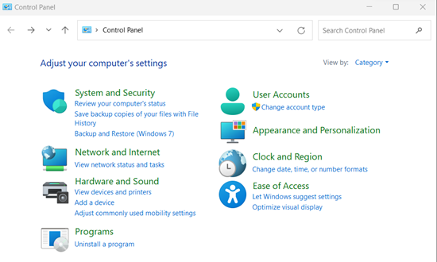
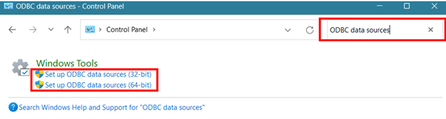
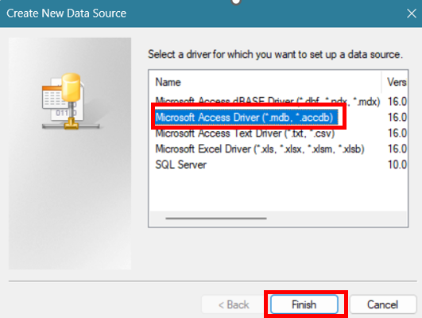
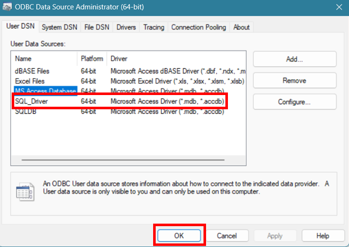

```{r setup, include=FALSE}
knitr::opts_chunk$set(echo = TRUE)
```

## Interfacing with a Microsoft Access database through Rstudio
Our project was investigating using the R package 'RODBC' to establish a connection
to a Microsoft Access Database (.mdb , .accdb) through RStudio, in order to query
the database using SQL language within R. 

## First you have to installl the package 
https://CRAN.R-project.org/package=RODBC
```{r eval=FALSE, include=TRUE}
install.packages("RODBC")
```

## The documentation for establishing the database connection with the RODBC package is as follows
```{r eval=FALSE, include=TRUE}
library("RODBC") #load package
db<-file.path("C:/path/to/your/database.accdb") #connect database.
channel<-odbcConnectAccess2007(db) #internal RODBC function
dataSetName<-sqlFetch(channel,"TableName") #read particular table from Access database file.
```

## Another option included specifying the Microsoft Driver
```{r eval= FALSE, include=TRUE}
## Set up driver info and database path
DRIVERINFO <- "Driver={Microsoft Access Driver (*.mdb, *.accdb)};"
MDBPATH <- "C:/path/to/your/database.accdb"
PATH <- paste0(DRIVERINFO, "DBQ=", MDBPATH)

## Establish connection
channel <- odbcDriverConnect(PATH)
```

## For this to work, you must have a ODBC Microsoft Access Driver installed on your computer
If you have Microsoft Access installed, the driver should already be installed. 
However, you can also install the drivers (32-bit or 64-bit) separately: 
https://www.microsoft.com/en-us/download/details.aspx?id=54920

## There are two ways that information about the driver and the location of the database system is provided to ODBC
The first way is to provide all information from within R each time the connection to the database system is established. To do this, you will need the file path of the database (EX. C:\Users\Lily\Desktop\SQL\Database.accdb),
and the driver information, as in the two examples above.

## Compatability Issues
Unfortunately there are compatability issues with this package when running 64-bit Windowns and Rstudio.
Some users reported having to change Rstudio to the 32-bit option. We tried several versions of Access and
Rstudio and were unsuccessful at establishing a connection using the database path. 

## Establishing a DSN 
Alternatively, you can establish a DSN (Data Source Name) so that the DNS describes the connection and only the DSN needs to be provided each time a connection is made. This is a workaround for establishing the Driver Connection on Windows, that seems to work ~ 50% of the time

Source: https://www.r-bloggers.com/2013/01/getting-access-data-into-r/  

## Step 1: Go to Control Panel 
```{r}

```

## Step 2: Search 'ODBC data sources'. Click on Set up ODBC data sources (either 32-bit or 64-bit depending on your version of Microsoft. In our case, we are using 64-bit)
```{r}

```

## Step 3: Under 'User DSN', you will see a list of the User Data Sources. Click 'Add…'
```{r}
knitr::include_graphics("Picture3.png")
```

## Step 4: Select Microsoft Access Driver(*.mdb, *.accdb). Then click 'Finish'
```{r}

```

## Step 5: Name your Data Source Name (DSN) and add a description, then click 'OK'
```{r}
knitr::include_graphics("Picture5.png")
```

## Step 6: Now, under 'User DSN"'you should see your newly named DSN. Click 'OK' again to close the window. 
```{r}

```

## Now you can access and import Access Database Tables into R using the DSN name you assigned in the previous steps
```{r}
#load package
library(RODBC)
#establish connection to DSN that you created manually 
con <- odbcConnect("ERMNSQL") #only the name is needed, not the full path
```

## View all the tables in the database
```{r}
sqlTables(con, tableType = "TABLE")$TABLE_NAME
```

## View column names in a table
```{r}
sqlColumns(con, "tbl_Events")$COLUMN_NAME
sqlColumns(con, "tbl_Sites")$COLUMN_NAME
sqlColumns(con, "tbl_Fish")$COLUMN_NAME
sqlColumns(con, "tbl_Fish_Count")$COLUMN_NAME
sqlColumns(con, "tbl_Habitat_Transect_Fields")$COLUMN_NAME
sqlColumns(con, "tbl_Habitat_Transect")$COLUMN_NAME
```

## Building queries to select specific columsn from a table
```{r}
WQqry <-  "SELECT Event_ID, Site_ID, Start_Date, Visit_Number, WQ_Time, Temp_C,
        SpecficConductance, DO_mgl, DO_Percent, pH, WaterColor, Secchi_Depth_cm 
        FROM  tbl_Events" #embed the SQL query language in an object

#use the RODBC command 'sqlQuery' to pass your query object to the connected database
SiteWQ <- sqlQuery(con, WQqry) 

#another query from a different table
nameqry <- "SELECT Site_ID, Site_Name From tbl_Sites"
SiteNames <- sqlQuery(con, nameqry)
```

## GROUP BY and AVG arguments
```{r}
pHqry <- "SELECT Site_ID, avg(pH) AS Average_pH, max(pH) AS Max_pH, min(pH) AS Min_pH  
      FROM tbl_EVENTS
      GROUP BY Site_ID"
pHWQ <- sqlQuery(con, pHqry)
```


## Unable to get JOINS to work, as syntax for sql queries is different from the DBI package
However, you can use base R 'merge' as a workaround

```{r}
#merging the two dataframes created from the first two queries above
SiteWQ <- merge(SiteNames, SiteWQ, by="Site_ID")
```


## Table of syntax differnces


## Next Steps


## Lessons Learned
