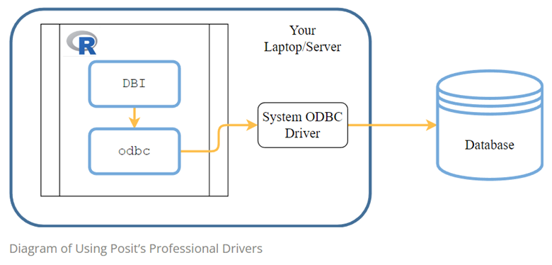
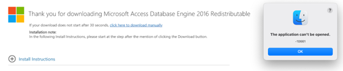
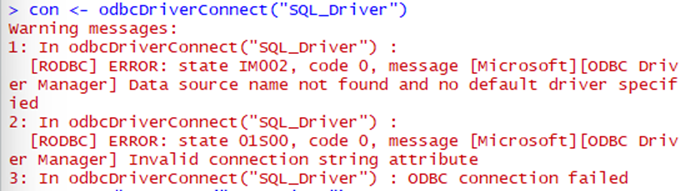
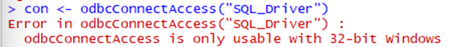
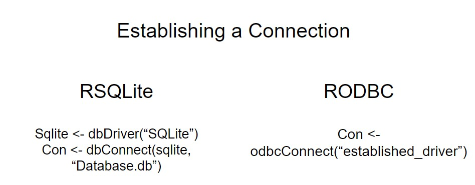
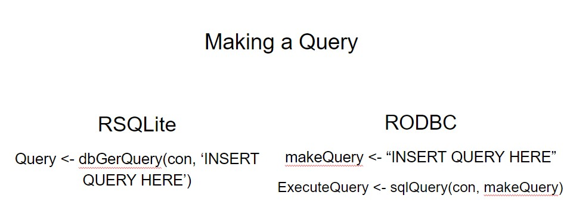
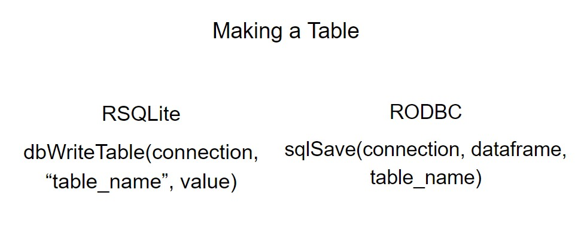
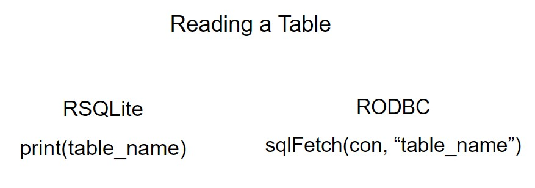
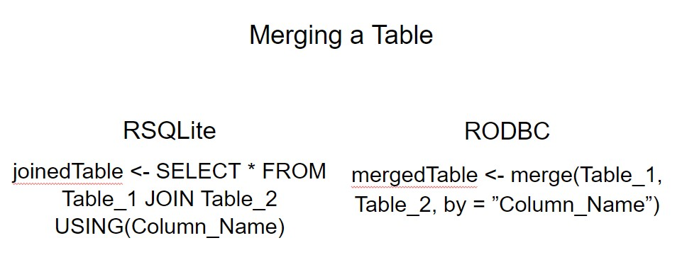
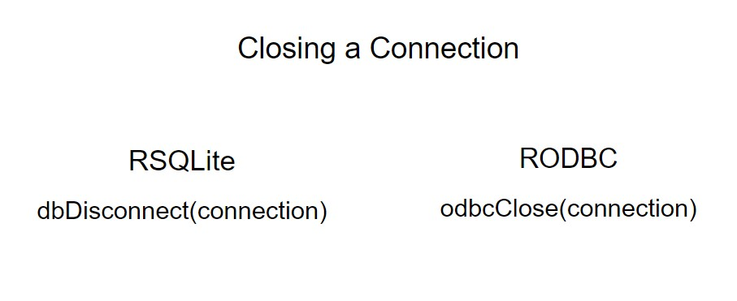

```{r setup, include=FALSE}
knitr::opts_chunk$set(echo = TRUE)
```

## Our aim
The main goal of this project was to integrate a Microsoft Access database into R
using the **RODBC** package. While this appeared very straightforward,
we ran into several complex issues. Here, we document the problems, solutions we found, and
some results we were able to accomplish.

## What is an Access database?
### Microsoft Access
Access is a database management system using Microsoft’s Jet Database Engine
Databases are created and stored in a unique format, making them not readily accessible to everyone

### Getting Access data into R Introduction
There are two methods to connect with Access databases
1. Using the ODBC (Open DataBase Connectivity) facility
2. Using the DBI (DataBase Interface) package in R
ODBC allows connection to a database to be opened
Then, SQL is needed to actually import database tables into R

### ODBC
ODBC allows access to a variety of database systems via a common interface
ODBC requires a specific driver to be installed (in our case, a Microsoft Access Driver which is already installed with the installation of Office) which serves as a translation layer between ODBC and the database system

```{r, echo=FALSE, out.width = "80%"}

```

## Interfacing with a Microsoft Access database through Rstudio
Our project was investigating using the R package 'RODBC' to establish a connection
to a Microsoft Access Database (.mdb , .accdb) through RStudio, in order to query
the database using SQL language within R. 

## First you have to installl the package 
https://CRAN.R-project.org/package=RODBC
```{r eval=FALSE, include=TRUE}
install.packages("RODBC")
```

## The documentation for establishing the database connection with the RODBC package is as follows
```{r eval=FALSE, include=TRUE}
library("RODBC") #load package
db<-file.path("C:/path/to/your/database.accdb") #connect database.
channel<-odbcConnectAccess2007(db) #internal RODBC function
dataSetName<-sqlFetch(channel,"TableName") #read particular table from Access database file.
```

## Another option included specifying the Microsoft Driver
```{r eval= FALSE, include=TRUE}
## Set up driver info and database path
DRIVERINFO <- "Driver={Microsoft Access Driver (*.mdb, *.accdb)};"
MDBPATH <- "C:/path/to/your/database.accdb"
PATH <- paste0(DRIVERINFO, "DBQ=", MDBPATH)

## Establish connection
channel <- odbcDriverConnect(PATH)
```

## For this to work, you must have a ODBC Microsoft Access Driver installed on your computer
If you have Microsoft Access installed, the driver should already be installed. 
However, you can also install the drivers (32-bit or 64-bit) separately: 
https://www.microsoft.com/en-us/download/details.aspx?id=54920

## There are two ways that information about the driver and the location of the database system is provided to ODBC
The first way is to provide all information from within R each time the connection to the database system is established. To do this, you will need the file path of the database (EX. C:\Users\Lily\Desktop\SQL\Database.accdb),
and the driver information, as in the two examples above.


## Establishing a DSN 
Alternatively, you can establish a DSN (Data Source Name) so that the DNS describes the connection and only the DSN needs to be provided each time a connection is made. This is a workaround for establishing the Driver Connection on Windows, that seems to work ~ 50% of the time

Source: https://www.r-bloggers.com/2013/01/getting-access-data-into-r/  

## Step 1: Go to Control Panel 
```{r, echo=FALSE, out.width = "80%"}
knitr::include_graphics("Picture1.png")
```

## Step 2: Search 'ODBC data sources'. Click on Set up ODBC data sources (either 32-bit or 64-bit depending on your version of Microsoft. In our case, we are using 64-bit)
```{r, echo=FALSE, out.width = "80%"}
knitr::include_graphics("Picture2.png")
```

## Step 3: Under 'User DSN', you will see a list of the User Data Sources. Click 'Add…'
```{r, echo=FALSE, out.width = "80%"}

```

## Step 4: Select Microsoft Access Driver(*.mdb, *.accdb). Then click 'Finish'
```{r, echo=FALSE, out.width = "80%"}
knitr::include_graphics("Picture4.png")
```

## Step 5: Name your Data Source Name (DSN) and add a description, then click 'OK'
```{r, echo=FALSE, out.width = "80%"}

```

## Step 6: Now, under 'User DSN"'you should see your newly named DSN. Click 'OK' again to close the window. 
```{r, echo=FALSE, out.width = "80%"}
knitr::include_graphics("Picture6.png")
```

## Now you can access and import Access Database Tables into R using the DSN name you assigned in the previous steps
```{r}
#load package
library(RODBC)
#establish connection to DSN that you created manually
#we named our DSN 'ERMNSQL'
con <- odbcConnect("ERMNSQL") #only the name is needed, not the full path
```

## View all the tables in the database
```{r}
sqlTables(con, tableType = "TABLE")$TABLE_NAME
```

## View column names in a table
```{r}
sqlColumns(con, "tbl_Events")$COLUMN_NAME
sqlColumns(con, "tbl_Sites")$COLUMN_NAME
sqlColumns(con, "tbl_Fish_Count")$COLUMN_NAME
```
## View specific tables
```{r}
sqlFetch(con, "tbl_Events", max = 10)
```


## Building queries to select specific columns from a table
```{r echo=TRUE}
WQqry <-  "SELECT Event_ID, Site_ID, Start_Date, Visit_Number, WQ_Time, Temp_C,
        SpecficConductance, DO_mgl, DO_Percent, pH, WaterColor, Secchi_Depth_cm 
        FROM  tbl_Events" #embed the SQL query language in an object

#use the RODBC command 'sqlQuery' to pass your query object to the connected database
SiteWQ <- sqlQuery(con, WQqry)

head(SiteWQ)

#another query from a different table
nameqry <- "SELECT Site_ID, Site_Name From tbl_Sites"
SiteNames <- sqlQuery(con, nameqry)

head(SiteNames)
```

## GROUP BY and AVG arguments
```{r}
pHqry <- "SELECT Site_ID, avg(pH) AS Average_pH, max(pH) AS Max_pH, min(pH) AS Min_pH  
      FROM tbl_EVENTS
      GROUP BY Site_ID"
pHWQ <- sqlQuery(con, pHqry)
head(pHWQ)
```


## Unable to get JOINS to work, as syntax for sql queries is different from the DBI package
### However, you can use base R 'merge' as a workaround
```{r}
#merging the two dataframes created from the first two queries above
SiteWQ <- merge(SiteNames, SiteWQ, by="Site_ID")
head(SiteWQ)
```


## Lessons Learned

### SQL Project Roadblocks
*Microsoft Access isn’t included in MS Office for macOS*
This means although you don’t need to have the Microsoft Access file opened to use in R, you won’t have the Microsoft Access Driver needed. You could use a virtual machine on your Mac to run window applications or dual boot Windows and macOS on your machine…

```{r, echo=FALSE, out.width = "80%"}

```


### Driver installation 
Instead of being able to connect to the Microsoft Access driver through a line of code as per the package documentation, we had to manually create a driver as outlined previously. 
Even then, only 2 of us were able to get R to connect to the DSN, as the computer is still unable to find the DSN or there is a mismatch between the Driver, the Database, and R. 
```{r, echo=FALSE, out.width = "80%"}

```


### Compatibility Issues
```{r, echo=FALSE, out.width = "80%"}

```

Using odbcConnectAccess() will sometimes give an error message indicating that odbcConnectAccess is only usable with 32-bit Windows. This can sometimes occur if you have 32 bit office installed on your machine and using 64-bit R… or for other unknown causes in our situation… (we got this error even though we had 64-bit R and Microsoft).

One way to potentially fix this is if you have R that has both 32-bit and 64-bit versions so you can switch to 32-bit, or download an older R version with 32-bit. The downside to switching to 32-bit is that you may come across issues such as memory issues. Then, make sure you have the 32-bit version of the Driver and proceed to establish the connection the same way as steps previously mentioned. Although, we tried this workaround and were still unable to get it to work.

### Syntax differences between 'DBI' and 'RODBC'
If you are familiar with arguments for SQL queries with the 'DBI' package, the arguments and syntax look a little different under the 'RODBC' package. This made it a little more challenging than we initially thought to just transfer the queries we learned to do in class.

```{r, echo=FALSE, out.width = "80%"}

```

```{r, echo=FALSE, out.width = "80%"}

```

```{r, echo=FALSE, out.width = "80%"}

```

```{r, echo=FALSE, out.width = "80%"}
knitr::include_graphics("Doc_4.jpg")
```

```{r, echo=FALSE, out.width = "80%"}

```

```{r, echo=FALSE, out.width = "80%"}

```

```{r, echo=FALSE, out.width = "80%"}

```
